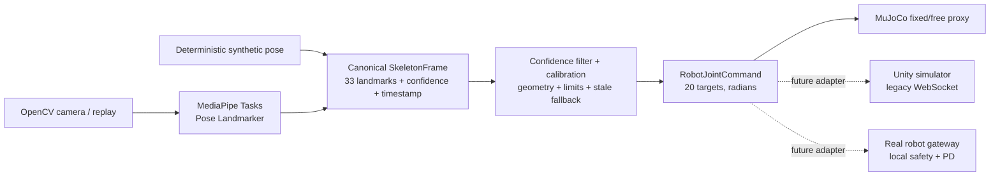

# Robot–human interface

Первый воспроизводимый прототип цепочки

`камера → MediaPipe Pose Landmarker → SkeletonFrame → геометрический retargeting → 20-DOF робот MuJoCo`.

Проект работает нативно на Windows без виртуальной машины. Все зависимости,
модель MediaPipe и копии исходных FBX находятся внутри этого репозитория. Unity
использовался только как read-only источник параметров и визуальной геометрии.

> Это исследовательский прототип, а не готовый контур управления реальным
> роботом. Текущий retargeter не удерживает равновесие, а физика робота пока
> основана на явно помеченной primitive proxy-модели. По умолчанию запускается
> fixed-base сцена.

## Быстрый запуск на Windows

Требуется 64-битный Python 3.12 и, для реального режима, камера Windows.
MuJoCo отдельно устанавливать в систему не нужно: официальный Python wheel
содержит нативную библиотеку.

Из PowerShell в корне проекта:

```powershell
Set-ExecutionPolicy -Scope Process Bypass
.\scripts\run_camera_teleop.ps1
```

Первый запуск автоматически создаёт `.venv`, ставит точные версии из
`requirements.lock.txt` и устанавливает локальный пакет. Всё остаётся внутри
`robot-human-interface`.

Явная подготовка окружения:

```powershell
.\scripts\setup_windows.ps1
```

Если Python 3.12 не находится автоматически:

```powershell
.\scripts\setup_windows.ps1 -PythonExe "C:\path\to\python.exe"
```

Клавиши в окне камеры:

- `C` — собрать нейтральную калибровку позы;
- `R` — сбросить симуляцию и состояние retargeter;
- `Space` — пауза/продолжение;
- `Esc` — корректно завершить приложение.

Обработка идёт по незеркальному кадру, чтобы физическая правая сторона человека
однозначно управляла суставами `*_rh`. Отображение при необходимости можно
зеркалировать отдельно. Значения камеры и confidence по умолчанию читаются из
`config/camera.yaml`; CLI имеет приоритет. Если источник уже требует отражения,
передайте `-MirrorInput` — после inference стороны будут канонизированы обратно.

## Запуск без камеры

Полностью сквозной deterministic smoke test использует синтетические кадры и
33-точечный синтетический скелет с движущейся правой рукой:

```powershell
.\scripts\run_camera_teleop.ps1 -Source synthetic -Headless -MaxFrames 120
```

С replay-видео:

```powershell
.\scripts\run_camera_teleop.ps1 -Source replay -ReplayPath "C:\data\motion.mp4"
```

Свободная база включается только явно:

```powershell
.\scripts\run_camera_teleop.ps1 -Source synthetic -FreeBase
```

В этом режиме нет balance-controller, поэтому робот закономерно может упасть.

MVP выполняет по 16 шагов MuJoCo (`2 ms`) на один входной кадр; это соответствует
примерно 30 Hz. Headless/replay могут идти быстрее wall clock, а нестандартный
FPS требует `--physics-steps-per-frame` через `-AdditionalArguments`. Для
реального робота perception и servo/balance loops должны быть разделены.

Запуск только стандартного MuJoCo viewer:

```powershell
.\.venv\Scripts\python.exe -m mujoco.viewer --mjcf=models\humanoid\scene_fixed.xml
```

Полный автоматический набор проверок:

```powershell
.\scripts\run_checks.ps1
```

Проверка именно camera → MediaPipe → retargeter → MuJoCo без окон:

```powershell
.\scripts\run_camera_teleop.ps1 -Source camera -Headless -MaxFrames 30
```

## Диагностика Windows

Если PowerShell сообщает, что выполнение сценариев отключено, разрешите его
только для текущего процесса:

```powershell
Set-ExecutionPolicy -Scope Process Bypass
```

Если камера не открывается:

1. проверьте, видит ли её Windows: `Get-PnpDevice -Class Camera`;
2. разрешите desktop apps доступ к камере в Windows Privacy settings;
3. закройте Zoom/Teams/браузер, если они удерживают устройство;
4. попробуйте другой индекс: `-CameraIndex 1`;
5. явно выберите backend:

```powershell
.\scripts\run_camera_teleop.ps1 -CameraBackend dshow
.\scripts\run_camera_teleop.ps1 -CameraBackend msmf
```

Если GLFW/OpenGL viewer не открывается, обновите драйвер GPU, не запускайте GUI
из закрытой RDP-сессии и сначала проверьте headless-режим. Headless physics не
требует окна:

```powershell
.\scripts\run_camera_teleop.ps1 -Source synthetic -Headless -MaxFrames 120
```

Ошибка об отсутствующем `pose_landmarker_full.task` означает, что runtime asset
не скопирован. Ожидаемый путь — `assets/models/pose_landmarker_full.task`; его
SHA-256 приведён в `assets/README.md`.

## Архитектура



Основные границы данных намеренно не зависят от симулятора:

- `CameraFrame` — BGR-кадр с monotonic timestamp;
- `SkeletonFrame` — 33 landmarks, visibility/presence и система координат;
- `RobotJointCommand` — имена и 20 целевых положений строго в радианах;
- `HumanoidState` — joint state, положение/ориентация базы, IMU-подобные
  скорости, усилия и число контактов.

## Порядок суставов

Этот порядок совпадает с активным `humanoid_control` и существующим Unity
WebSocket-протоколом:

```text
 0 shoulder_rh       10 knee_rl
 1 shoulder_lh       11 knee_ll
 2 elbow_rh          12 shin_rl
 3 elbow_lh          13 shin_ll
 4 wrist_rh          14 motors_feet_rl
 5 wrist_lh          15 motors_feet_ll
 6 rotat_axis_rl     16 foot_rl
 7 rotat_axis_ll     17 foot_ll
 8 motors_thigh_rl   18 neck
 9 motors_thigh_ll   19 head
```

Внутри Python и MuJoCo используются радианы. Будущий legacy WebSocket adapter
должен переводить значения в градусы только на внешней границе и отправлять
версию схемы/robot model вместе с массивом.

## Модель MuJoCo

- `scene_fixed.xml` использует weld базы и является безопасным default для
  проверки интерфейса;
- `scene_free.xml` оставляет free joint базы и предназначен для будущего
  balance-controller;
- 20 position actuators следуют каноническому порядку независимо от внутреннего
  body traversal MuJoCo;
- масса torso и 20 rigid bodies перенесена из активной Unity-модели; суммарно
  `2.933134 kg`;
- joint hierarchy, axes, anchors, limits и start pose извлечены из активного
  prefab;
- primitive geoms, inertia/CoM, actuator gains, friction, collision shapes,
  масштаб `0.35` и преобразование Unity LH → MuJoCo RH пока **provisional**.

Unity не сериализует CoM и inertia: PhysX вычисляет их из convex MeshCollider во
время запуска. Поэтому выдать эти величины за точные было бы неверно. До
sim-to-real нужны CAD/URDF, реальные массы, геометрия коллизий, motor/gear data и
system identification.

Полный протокол извлечения находится в
[`docs/unity_model_extraction.md`](docs/unity_model_extraction.md), происхождение
FBX и MediaPipe bundle — в [`assets/README.md`](assets/README.md).

## Retargeting и потеря позы

Текущая реализация — понятный geometric baseline без нейросетевого
balance-controller:

1. MediaPipe Tasks выдаёт 33 точки, confidence и hip-relative learned 3D.
2. Скелет канонизируется и сглаживается с учётом confidence.
3. Из сегментов вычисляются shoulder/elbow/wrist, hip/knee/ankle и head angles.
4. Калибровка определяет нейтральную позу конкретного пользователя.
5. Значения ограничиваются точными Unity joint limits и сглаживаются.
6. При кратком dropout удерживается последняя команда; затем робот плавно
   возвращается в neutral pose.

Landmarks с низкой уверенностью не используются для соответствующего сустава.
Например, плохие `INDEX/PINKY` не могут создать случайную команду wrist, а
плохие `NOSE/EARS` — команду головы.

MediaPipe monocular world landmarks нельзя считать точным измерением глубины или
анатомических центров суставов. Для научной ветки имеет смысл добавить RGB-D,
кинематический fit и сравнить MediaPipe с обучаемым RTMPose/RTMW3D baseline.

## Структура

```text
assets/                         MediaPipe bundle и копии 21 Unity FBX
config/                         joint/camera/retargeting параметры
docs/                           протокол извлечения и ограничения
models/humanoid/                MJCF robot + fixed/free scenes
scripts/                        setup, запуск и проверки Windows
src/robot_human_interface/
  app/                          end-to-end цикл и CLI
  camera/                       camera, replay, synthetic frame sources
  pose/                         MediaPipe Tasks и synthetic skeleton
  skeleton/                     типы, фильтрация, transforms
  retargeting/                  geometry, calibration, safety fallback
  simulation/                   MuJoCo API и state/command boundary
tests/                          unit, model, physics и integration tests
```

## Переезд на Ubuntu 24.04

MuJoCo не требует Ubuntu 22.04. Ubuntu 24.04 содержит Python 3.12 и является
правильной целью для будущего ROS 2 Jazzy. Код использует `pathlib` и не требует
Windows API; платформенными остаются только PowerShell wrappers.

Базовая установка без ROS:

```bash
sudo apt update
sudo apt install python3-venv libgl1 libglib2.0-0 libportaudio2
python3 -m venv .venv
source .venv/bin/activate
python -m pip install -r requirements.lock.txt
python -m pip install --no-deps --no-build-isolation -e .
python -m pytest
python -m robot_human_interface.app.teleop --source synthetic --headless --max-frames 120
```

Для GUI нужен рабочий OpenGL/display. На headless-машине остаются unit tests и
physics loop; camera/display можно подключать отдельно.

Следующий инфраструктурный этап на Ubuntu:

1. оформить robot description как единый URDF/xacro + meshes + calibration;
2. добавить ROS 2 Jazzy nodes для `SkeletonFrame`, reference command и state;
3. подключить `ros2_control`/`mujoco_ros2_control` для одинаковой controller
   boundary в симуляции и на железе;
4. оставить старый WebSocket как тонкий versioned adapter для Unity и реального
   контроллера, а не как внутренний servo loop;
5. экспортировать будущую policy в ONNX и проверять одинаковый порядок
   observations/actions на Windows, Ubuntu, MuJoCo и роботе.

Официально MuJoCo ставится через `pip install mujoco`, причём библиотека входит
в wheel: [MuJoCo Python documentation](https://mujoco.readthedocs.io/en/latest/python.html).
Для Jazzy уже существует пакет
[`mujoco_ros2_control`](https://control.ros.org/jazzy/doc/mujoco_ros2_control/doc/index.html).

## Научное продолжение

Корректная будущая policy не должна получать только скелет человека. Одна и та
же целевая поза требует разных действий в зависимости от текущего состояния
робота. Практичная постановка:

```text
(human target / q_IK, robot q/dq, IMU, previous action, short history)
    → bounded residual Δq
q_des = clamp(q_IK + scale · tanh(Δq))
```

MediaPipe/camera остаются сравнительно медленным каналом намерения. Быстрый
balance loop, encoder/IMU feedback, limits, watchdog и E-stop должны работать
локально на роботе и не зависеть от WebSocket или камеры.

Полезные baseline для диссертации: direct copy, geometry+clamp, constrained IK,
absolute RL, residual-on-IK, privileged teacher→deployable student и independent
safety shield. Оценивать следует не только pose error, но и fall rate,
time-to-fall, foot slip, contact errors, latency p50/p95/p99, torque saturation,
jerk, recovery from pushes и sim-to-sim/sim-to-real gap.

## Проверенный статус этой сборки

- Windows native Python `3.12.13`;
- MuJoCo `3.11.0`, MediaPipe `0.10.35`, OpenCV `5.0.0`;
- обе MJCF-сцены загружаются, 20 actuator mappings совпадают со схемой;
- 1000 physics steps для fixed/free остаются finite;
- self-contact proxy в home pose устранён; максимальная tracking error после
  1000 шагов около `1.20°`;
- synthetic end-to-end: 30/30 skeleton frames, 0 stale commands;
- `38 passed` в полном pytest-наборе;
- 21 FBX-копия совпадает с Unity-источниками по SHA-256;
- Unity git status остался чистым.

Лог: `artifacts/verification.log`. Offscreen-кадр:
`artifacts/mujoco_fixed_home.png`.

На машине, где собирался проект, Windows не обнаружила ни одного устройства
класса Camera, поэтому физический webcam frame проверить было невозможно.
MediaPipe Full bundle при этом был реально открыт через Tasks API и выполнил
inference; полный camera-free pipeline проверен synthetic-источником. После
подключения камеры используйте camera smoke command из раздела диагностики.
