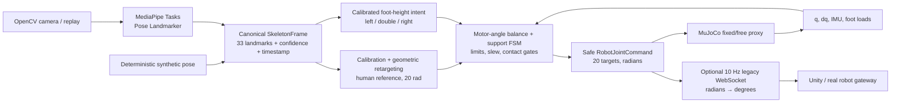

# Robot–human interface

Первый воспроизводимый прототип цепочки

`камера/MP4 → MediaPipe → SkeletonFrame → retargeting → motor-angle safety → 20-DOF MuJoCo / legacy WebSocket`.

Проект работает нативно на Windows без виртуальной машины. Все зависимости,
модель MediaPipe и копии исходных FBX находятся внутри этого репозитория. Unity
использовался только как read-only источник параметров и визуальной геометрии.

> Это исследовательский прототип, а не готовый контур безопасности реального
> робота. В free-base MuJoCo уже работает классический motor-angle controller:
> он копирует руки, переносит вес перед подъёмом ноги, проверяет нагрузку стоп и
> не фиксирует корпус в физике. На реальном роботе ему всё ещё нужны настоящие
> encoder/IMU/foot-sensor observations, локальный watchdog и E-stop. Collision
> shapes, inertia/CoM и gains текущей модели явно помечены provisional. Поэтому
> по умолчанию сохранена grounded-fixed сцена, а свободная база включается
> осознанно параметром `-FreeBase`.

## Windows: пошаговый запуск

Все команды ниже нужно вводить в **PowerShell**, а не в Python-консоль. Подойдёт
Windows Terminal с профилем PowerShell или обычное приложение «Windows
PowerShell». Запуск от администратора не требуется. В примеры не нужно копировать
приглашение вида `PS C:\...>` — вводите только сами команды из блоков.

### 1. Один раз установите Python 3.12 x64

При установке Python желательно включить пункт `Add python.exe to PATH`. MuJoCo
отдельно устанавливать в Windows не нужно: он будет установлен в локальное
окружение проекта.

Откройте PowerShell и проверьте версию:

```powershell
python --version
```

Ожидаемый результат начинается с `Python 3.12`. Посмотреть, какой исполняемый
файл найден Windows, можно так:

```powershell
where.exe python
```

Если в системе несколько Python, запомните полный путь к версии 3.12 — его можно
передать скрипту на шаге 5.

### 2. В PowerShell перейдите в папку проекта

На текущем компьютере проект находится здесь:

```powershell
Set-Location "C:\Users\k_desktop\Desktop\robot-human-interface"
```

Если проект был перенесён, замените путь на фактический. Убедитесь, что вы
находитесь в правильной папке:

```powershell
Get-Location
Test-Path .\scripts\setup_windows.ps1
```

`Test-Path` должен вывести `True`. Все последующие команды выполняются **из этой
папки**.

### 3. Разрешите PowerShell-скрипты для текущего окна

```powershell
Set-ExecutionPolicy -Scope Process -ExecutionPolicy Bypass
```

Это разрешение действует только до закрытия текущего PowerShell и не изменяет
глобальные настройки Windows.

### 4. Проверьте, что камера доступна Windows

Этот шаг нужен только для управления по реальной камере. Подключите камеру и
выполните:

```powershell
Get-PnpDevice -Class Camera
```

Если список пуст, сначала подключите/включите камеру. Для запуска synthetic-
режима камера не требуется.

### 5. Подготовьте локальное окружение проекта

На первом запуске выполните:

```powershell
.\scripts\setup_windows.ps1
```

Скрипт создаст `.venv` внутри `robot-human-interface`, установит точные версии
из `requirements.lock.txt` и сам проект. Глобальный Python и другие проекты не
изменяются. Повторный вызов безопасен: существующая `.venv` будет использована
повторно.

Если скрипт не нашёл Python 3.12 автоматически, укажите полный путь, полученный
на шаге 1. Пример:

```powershell
.\scripts\setup_windows.ps1 -PythonExe "C:\Program Files\Python312\python.exe"
```

Успешная установка заканчивается сообщением `Windows setup complete`.

### 6. Первый безопасный запуск без камеры

Сначала проверьте весь pipeline на синтетическом скелете:

```powershell
.\scripts\run_camera_teleop.ps1 -Source synthetic
```

Откроются два окна:

1. `MuJoCo : humanoid_v4_grounded_fixed` — симуляция робота;
2. `Robot human interface - camera skeleton` — синтетический кадр и скелет.

Чтобы остановить программу, выберите окно `camera skeleton` и нажмите `Esc`.
В том же окне `camera skeleton` нажмите `V`, чтобы переключать MuJoCo между
полноценной 3D-моделью и кинематическим видом суставов.

### 7. Запуск на встроенном MP4

В репозитории есть два лицензированных видео с человеком в полный рост. По
умолчанию запускается медленный 65-секундный тест: сначала плавные движения
руками, затем баланс последовательно на каждой ноге. Он проходит через тот же
MediaPipe → retargeting → MuJoCo pipeline, что и камера:

```powershell
.\scripts\run_camera_teleop.ps1 -Source mp4 -LoopReplay
```

То же самое с явным выбором теста:

```powershell
.\scripts\run_camera_teleop.ps1 -Source mp4 -DemoVideo slow-balance -LoopReplay
```

Проверка именно свободной физики и motor-angle balance layer (без weld/каретки):

```powershell
.\scripts\run_camera_teleop.ps1 -Source mp4 -DemoVideo slow-balance -FreeBase
```

На эталонном полном прогоне обе swing-стопы отрываются на `3.5–4.1 cm`,
максимальный наклон корпуса остаётся около `13.1°`, падение не регистрируется,
а время MuJoCo расходится с временем MP4 не более чем на один шаг `2 ms`.

Старый быстрый ролик с jumping jacks сохранён как отдельный вариант:

```powershell
.\scripts\run_camera_teleop.ps1 -Source mp4 -DemoVideo jumping-jacks -LoopReplay
```

Медленный ролик воспроизводится с частотой 29,97 FPS, но движения внутри него
замедлены ровно в два раза. Откроются окно исходного кадра со скелетом и MuJoCo
viewer с роботом. Источник, авторы, лицензии, преобразования и контрольные суммы
записаны в `assets/README.md`.

### 8. Запуск с реальной камерой

Из того же PowerShell и той же папки выполните:

```powershell
.\scripts\run_camera_teleop.ps1 -Source camera
```

Короткая эквивалентная команда, поскольку `camera` является режимом по
умолчанию:

```powershell
.\scripts\run_camera_teleop.ps1
```

Если нужна другая камера или backend Windows:

```powershell
.\scripts\run_camera_teleop.ps1 -Source camera -CameraIndex 1
.\scripts\run_camera_teleop.ps1 -Source camera -CameraBackend dshow
.\scripts\run_camera_teleop.ps1 -Source camera -CameraBackend msmf
```

### 9. Опциональный вывод в Unity/на робота по WebSocket

Сетевой выход и подключение по умолчанию полностью выключены; библиотека
транспорта устанавливается обычным `setup_windows.ps1`. После проверки E-stop,
знаков/нулей моторов, локального watchdog и ограничения
скорости включите экспериментальный выход явным URL. `-FreeBase` обязателен,
чтобы наружу не могла уйти необработанная fixed-base команда:

```powershell
.\scripts\run_camera_teleop.ps1 `
  -Source camera `
  -FreeBase `
  -RobotWebSocketUrl "ws://127.0.0.1:1233"
```

Наружу отправляется именно итоговая `safe_command`, уже после balance/support
controllers, с частотой 10 Hz и latest-only семантикой. Формат байт-в-байт
совпадает с активным Unity-кодом; радианы переводятся в градусы только здесь:

```json
{"id":0,"method":"setPositions","params":[0.0,0.0,0.0,0.0,0.0,0.0,0.0,0.0,0.0,0.0,0.0,0.0,0.0,0.0,0.0,0.0,0.0,0.0,0.0,0.0]}
```

Обрыв сети не останавливает камеру и MuJoCo. Это пока shadow/experimental
boundary: controller получает q/dq/IMU/foot loads из MuJoCo, а не с настоящего
робота. До подачи мощности нужны реальная обратная связь, проверка ответа
сервера/`setVelocities` handshake, robot-side slew limit, watchdog на потерю
команд и безопасное повторное подключение от измеренных углов.

При EOF, `Esc` или ошибке источника текущий shadow-клиент закрывает транспорт,
но не может подтвердить по датчикам физического робота возврат в double support;
сервер может удержать последнюю команду. Поэтому до реализации real-feedback
shutdown этот путь нельзя использовать с включённой мощностью без независимого
watchdog, который сам переводит робота в заранее проверенное безопасное состояние.

При активном `-RobotWebSocketUrl` клавиша `Space` намеренно отключена: заморозка
приложения оставила бы физический робот на последней, возможно одноопорной,
команде. Это не замена аварийной остановке — для реального стенда обязательны
аппаратный E-stop и независимый robot-side watchdog.

### 10. Клавиши управления во время работы

Клавиши обрабатываются, когда активно окно `Robot human interface - camera
skeleton`:

- `C` — заново откалибровать нейтральную позу и вертикаль камеры; встаньте
  ровно, поставьте обе стопы на пол и не двигайтесь;
- `R` — сбросить MuJoCo, retargeter, balance/support controllers и калибровку;
- `V` — переключить MuJoCo между 3D-моделью и видом суставов;
- `Space` — заморозить/продолжить видео и симуляцию; при активном выводе на
  физический робот эта клавиша заблокирована;
- `Esc` — закрыть приложение.

### 11. Полная автоматическая проверка

```powershell
.\scripts\run_checks.ps1
```

Команда проверяет импорты, запускает весь `pytest` и выполняет конечный
camera-free end-to-end smoke test.

### 12. Повторный запуск после перезагрузки Windows

Повторно устанавливать зависимости не нужно. Откройте PowerShell и выполните:

```powershell
Set-Location "C:\Users\k_desktop\Desktop\robot-human-interface"
Set-ExecutionPolicy -Scope Process -ExecutionPolicy Bypass
.\scripts\run_camera_teleop.ps1 -Source synthetic
```

Для реальной камеры замените последнюю строку на:

```powershell
.\scripts\run_camera_teleop.ps1 -Source camera
```

Для встроенного MP4 замените её на:

```powershell
.\scripts\run_camera_teleop.ps1 -Source mp4 -LoopReplay
```

Обработка идёт по незеркальному кадру, чтобы физическая правая сторона человека
однозначно управляла суставами `*_rh`. Значения камеры и confidence по умолчанию
читаются из `config/camera.yaml`; параметры командной строки имеют приоритет.
Если источник требует отражения, добавьте `-MirrorInput` — после inference
анатомические стороны будут канонизированы обратно.

## Запуск без камеры

Полностью сквозной deterministic smoke test использует синтетические кадры и
33-точечный синтетический скелет с движущейся правой рукой:

```powershell
.\scripts\run_camera_teleop.ps1 -Source synthetic -Headless -MaxFrames 120
```

Встроенное MP4 с реальным человеком:

```powershell
.\scripts\run_camera_teleop.ps1 -Source mp4 -LoopReplay
```

С произвольным MP4 пользователя:

```powershell
.\scripts\run_camera_teleop.ps1 -Source replay -VideoPath "C:\data\motion.mp4"
```

Чтобы зациклить пользовательский файл:

```powershell
.\scripts\run_camera_teleop.ps1 -Source replay -VideoPath "C:\data\motion.mp4" -LoopReplay
```

Начальный вид робота можно выбрать из PowerShell; во время работы клавиша `V`
переключает его без перезапуска и без изменения физики:

```powershell
# Полная оболочка из OBJ, режим по умолчанию
.\scripts\run_camera_teleop.ps1 -Source mp4 -LoopReplay -ViewerMode visual

# Только суставы и связи между ними
.\scripts\run_camera_teleop.ps1 -Source mp4 -LoopReplay -ViewerMode joints
```

Свободная база включается только явно:

```powershell
.\scripts\run_camera_teleop.ps1 -Source mp4 -DemoVideo slow-balance -FreeBase
```

В этом режиме на каждом физическом шаге `2 ms` выполняется motor-angle balance
layer. Камера задаёт медленную целевую позу, а q/dq, ориентация/угловая скорость
корпуса и нагрузки стоп определяют безопасную итоговую команду. Перед подъёмом
ноги робот сначала переносит вес на противоположную стопу и подтверждает её
нагрузку. Новый одноопорный цикл не начинается при наклоне больше `12°` или
угловой скорости больше `1 rad/s`; во время цикла выход за `18°`/`3 rad/s`
запускает контролируемое опускание и центрирование. При dropout действует тот
же безопасный возврат.

По умолчанию число физических шагов вычисляется по timestamps источника через
fixed-timestep accumulator. Поэтому MP4/camera FPS и MuJoCo time не расходятся;
ручной `--physics-steps-per-frame` нужен только для специальных экспериментов.
Headless MP4 может вычисляться быстрее реального времени, но при включённом
WebSocket автоматически воспроизводится в реальном времени. На железе
perception и локальный servo/balance loop всё равно должны быть разделены.

Запуск только стандартного MuJoCo viewer:

```powershell
.\.venv\Scripts\python.exe -m mujoco.viewer --mjcf=models\humanoid\scene_fixed.xml
```

Полный автоматический набор проверок:

```powershell
.\scripts\run_checks.ps1
```

Проверка именно camera → MediaPipe → retargeter → MuJoCo без окон:

```powershell
.\scripts\run_camera_teleop.ps1 -Source camera -Headless -MaxFrames 30
```

## Диагностика Windows

Если PowerShell сообщает, что выполнение сценариев отключено, разрешите его
только для текущего процесса:

```powershell
Set-ExecutionPolicy -Scope Process Bypass
```

Если камера не открывается:

1. проверьте, видит ли её Windows: `Get-PnpDevice -Class Camera`;
2. разрешите desktop apps доступ к камере в Windows Privacy settings;
3. закройте Zoom/Teams/браузер, если они удерживают устройство;
4. попробуйте другой индекс: `-CameraIndex 1`;
5. явно выберите backend:

```powershell
.\scripts\run_camera_teleop.ps1 -CameraBackend dshow
.\scripts\run_camera_teleop.ps1 -CameraBackend msmf
```

Если GLFW/OpenGL viewer не открывается, обновите драйвер GPU, не запускайте GUI
из закрытой RDP-сессии и сначала проверьте headless-режим. Headless physics не
требует окна:

```powershell
.\scripts\run_camera_teleop.ps1 -Source synthetic -Headless -MaxFrames 120
```

Ошибка об отсутствующем `pose_landmarker_full.task` означает, что runtime asset
не скопирован. Ожидаемый путь — `assets/models/pose_landmarker_full.task`; его
SHA-256 приведён в `assets/README.md`.

## Архитектура



Основные границы данных намеренно не зависят от симулятора:

- `CameraFrame` — BGR-кадр с monotonic timestamp;
- `SkeletonFrame` — 33 landmarks, visibility/presence и система координат;
- `RobotJointCommand` — имена и 20 целевых положений строго в радианах;
- `HumanoidState` — joint state, положение/ориентация базы, IMU-подобные
  скорости, CoM, позиции/нагрузки стоп, усилия и число контактов;
- `HumanSupportEstimate` — confidence-gated намерение поднять левую/правую стопу;
- `safe RobotJointCommand` — единственная команда, которую получают MuJoCo и
  опциональный внешний WebSocket.

## Порядок суставов

Этот порядок совпадает с активным `humanoid_control` и существующим Unity
WebSocket-протоколом:

```text
 0 shoulder_rh       10 knee_rl
 1 shoulder_lh       11 knee_ll
 2 elbow_rh          12 shin_rl
 3 elbow_lh          13 shin_ll
 4 wrist_rh          14 motors_feet_rl
 5 wrist_lh          15 motors_feet_ll
 6 rotat_axis_rl     16 foot_rl
 7 rotat_axis_ll     17 foot_ll
 8 motors_thigh_rl   18 neck
 9 motors_thigh_ll   19 head
```

Внутри Python и MuJoCo используются радианы. Реализованный
`LegacyWebSocketEncoder` проверяет полный именованный набор, переставляет его в
этот порядок, проверяет Unity limits и переводит значения в градусы только на
внешней границе. Текущий legacy server не принимает schema/model id, поэтому
версионированный envelope остаётся следующим изменением протокола.

## Модель MuJoCo

- `scene_fixed.xml` связывает torso с кареткой, которая свободно движется по
  вертикали: обе стопы физически принимают вес робота, а x/y и ориентация базы
  стабилизированы для безопасной проверки копирующего интерфейса;
- `scene_free.xml` оставляет настоящий free joint базы; текущий controller
  удерживает его только целевыми углами 20 приводов, не записывая base pose и
  не прикладывая внешних сил;
- 21 OBJ-меш из Unity используется только для визуализации; `V` переключает
  mesh-вид и суставную схему, не затрагивая состояние и контакты;
- земля относится к render group 0, OBJ — к group 1, физические collision
  primitives — к group 2;
- 20 position actuators следуют каноническому порядку независимо от внутреннего
  body traversal MuJoCo;
- масса torso и 20 rigid bodies перенесена из активной Unity-модели; суммарно
  `2.933134 kg`;
- joint hierarchy, axes, anchors, limits и start pose извлечены из активного
  prefab;
- OBJ-геометрия получена из исходных FBX через изолированный Unity batch-import;
  primitive collisions, inertia/CoM, actuator gains, friction, масштаб `0.35`
  и преобразование Unity LH → MuJoCo RH пока **provisional**.

Unity не сериализует CoM и inertia: PhysX вычисляет их из convex MeshCollider во
время запуска. Поэтому выдать эти величины за точные было бы неверно. До
sim-to-real нужны CAD/URDF, реальные массы, геометрия коллизий, motor/gear data и
system identification.

Полный протокол извлечения находится в
[`docs/unity_model_extraction.md`](docs/unity_model_extraction.md), происхождение
FBX и MediaPipe bundle — в [`assets/README.md`](assets/README.md).

## Retargeting, перед робота и устойчивость

Текущая реализация — понятный geometric + classical-control baseline, на фоне
которого затем можно честно сравнивать нейросеть:

1. MediaPipe Tasks выдаёт 33 точки, confidence и hip-relative learned 3D.
2. Скелет канонизируется и сглаживается с учётом confidence.
3. Из сегментов вычисляются shoulder/elbow/wrist, hip/knee/ankle и head angles.
4. Калибровка определяет нейтральную позу конкретного пользователя.
5. Значения ограничиваются точными Unity joint limits и сглаживаются.
6. При кратком dropout удерживается последняя команда; затем робот плавно
   возвращается в neutral pose.
7. Перед человека определяется в реальных MediaPipe camera axes; semantic FK
   tests проверяют, что рука/нога вперёд движутся вдоль физического переда
   робота `-X`, а не просто дают ожидаемый знак в массиве.
8. В double support копируется верх тела, а ограниченный ankle residual зависит
   от IMU-подобных pitch/pitch-rate и фактической траектории рук.
9. Подъём стопы превращается в последовательность `shift → verify load → lift →
   hold → lower → verify touchdown → center`: отрыв разрешается только после
   подтверждённой нагрузки противоположной стопы, а перенос веса обратно —
   только после измеренного контакта возвращённой стопы с полом.
10. Если человек поднимает вторую ногу, пока робот безопасно завершает первый
    цикл, намерение хранится в одном ограниченном по времени слоте и запускается
    лишь после подтверждённого возврата в `double support`; прямого переключения
    опорной ноги в воздухе нет.
11. Перед началом одноопорного цикла и во время его активной части проверяются
    ориентация корпуса и полная угловая скорость; выход за настроенный envelope
    не меняет base pose, а переводит те же моторные targets в безопасный возврат.

Таким образом сеть позже сможет выдавать bounded residual к этому baseline, а
не учиться одновременно угадывать индексы моторов, кинематику и базовое
поведение при потере опоры.

Landmarks с низкой уверенностью не используются для соответствующего сустава.
Например, плохие `INDEX/PINKY` не могут создать случайную команду wrist, а
плохие `NOSE/EARS` — команду головы.

MediaPipe monocular world landmarks нельзя считать точным измерением глубины или
анатомических центров суставов. Для научной ветки имеет смысл добавить RGB-D,
кинематический fit и сравнить MediaPipe с обучаемым RTMPose/RTMW3D baseline.

## Структура

```text
assets/                         MediaPipe bundle, тестовый MP4 и копии 21 Unity FBX
config/                         joint/camera/retargeting/balance параметры
docs/                           протокол извлечения и ограничения
models/humanoid/                MJCF, fixed/free scenes и 21 visual OBJ
scripts/                        setup, запуск и проверки Windows
src/robot_human_interface/
  app/                          end-to-end цикл и CLI
  camera/                       camera, replay, synthetic frame sources
  pose/                         MediaPipe Tasks и synthetic skeleton
  skeleton/                     типы, фильтрация, transforms
  retargeting/                  geometry, calibration, safety fallback
  control/                      standing balance, foot intent, support FSM
  protocol/                     legacy Unity/WebSocket encoder + 10 Hz publisher
  simulation/                   MuJoCo API и state/command boundary
tests/                          unit, model, physics и integration tests
tools/fbx_converter_unity/      изолированный FBX → OBJ batch-конвертер
```

## Переезд на Ubuntu 24.04

MuJoCo не требует Ubuntu 22.04. Ubuntu 24.04 содержит Python 3.12 и является
правильной целью для будущего ROS 2 Jazzy. Код использует `pathlib` и не требует
Windows API; платформенными остаются только PowerShell wrappers.

Базовая установка без ROS:

```bash
sudo apt update
sudo apt install python3-venv libgl1 libglib2.0-0 libportaudio2
python3 -m venv .venv
source .venv/bin/activate
python -m pip install -r requirements.lock.txt
python -m pip install --no-deps --no-build-isolation -e .
python -m pytest
python -m robot_human_interface.app.teleop --source synthetic --headless --max-frames 120
```

Для GUI нужен рабочий OpenGL/display. На headless-машине остаются unit tests и
physics loop; camera/display можно подключать отдельно.

Следующий инфраструктурный этап на Ubuntu:

1. оформить robot description как единый URDF/xacro + meshes + calibration;
2. добавить ROS 2 Jazzy nodes для `SkeletonFrame`, reference command и state;
3. подключить `ros2_control`/`mujoco_ros2_control` для одинаковой controller
   boundary в симуляции и на железе;
4. обернуть уже реализованный legacy WebSocket boundary версионированным
   ROS/robot-state adapter, оставив его внешним 10 Hz каналом, а не внутренним
   servo loop;
5. экспортировать будущую policy в ONNX и проверять одинаковый порядок
   observations/actions на Windows, Ubuntu, MuJoCo и роботе.

Официально MuJoCo ставится через `pip install mujoco`, причём библиотека входит
в wheel: [MuJoCo Python documentation](https://mujoco.readthedocs.io/en/latest/python.html).
Для Jazzy уже существует пакет
[`mujoco_ros2_control`](https://control.ros.org/jazzy/doc/mujoco_ros2_control/doc/index.html).

## Научное продолжение

Корректная будущая policy не должна получать только скелет человека. Одна и та
же целевая поза требует разных действий в зависимости от текущего состояния
робота. Практичная постановка:

```text
(human target / q_IK, robot q/dq, IMU, previous action, short history)
    → bounded residual Δq
q_des = clamp(q_IK + scale · tanh(Δq))
```

MediaPipe/camera остаются сравнительно медленным каналом намерения. Быстрый
balance loop, encoder/IMU feedback, limits, watchdog и E-stop должны работать
локально на роботе и не зависеть от WebSocket или камеры.

Полезные baseline для диссертации: direct copy, geometry+clamp, constrained IK,
absolute RL, residual-on-IK, privileged teacher→deployable student и independent
safety shield. Оценивать следует не только pose error, но и fall rate,
time-to-fall, foot slip, contact errors, latency p50/p95/p99, torque saturation,
jerk, recovery from pushes и sim-to-sim/sim-to-real gap.

## Проверенный статус этой сборки

- Windows native Python `3.12.13`;
- MuJoCo `3.11.0`, MediaPipe `0.10.35`, OpenCV `5.0.0`,
  websocket-client `1.9.0`;
- обе MJCF-сцены загружаются, 20 actuator mappings совпадают со схемой;
- 1000 physics steps для fixed/free остаются finite;
- grounded-fixed после усадки имеет контакты обеих стоп и передаёт на пол около
  `28.8 N`, то есть практически полный вес робота;
- visual sole и collision sole согласованы с плоскостью примерно до `1 mm`;
- self-contact proxy в home pose устранён; максимальная tracking error под
  собственным весом после 1000 шагов меньше `3°`;
- semantic FK-регрессии подтверждают: движение человеческой руки/ноги вперёд
  перемещает соответствующую конечность вдоль физического переда робота `-X`;
- synthetic free-base end-to-end: 60/60 skeleton frames, 0 stale commands,
  `max_tilt=2.205°`, `fell=0`;
- полный slow-balance MP4: 1961 frame, обе ноги подняты (`3.52/4.08 cm`),
  `base_z=0.9067 m`, `max_tilt=13.086°`, `fell=0`, рассинхронизация
  media/simulation меньше одного шага `2 ms`;
- отказ локального WebSocket endpoint изолирован: camera/physics run завершается
  штатно и отражает ошибку в итоговой статистике;
- `116 passed` в полном pytest-наборе;
- 21 FBX-копия сохранена, а 21 OBJ-меш компилируется в обеих MJCF-сценах;
- Unity git status остался чистым.

Лог: `artifacts/verification.log`. Проверенные offscreen-кадры обоих режимов:
`artifacts/mujoco_fixed_home.png` и `artifacts/mujoco_joints_home.png`.

На машине, где собирался проект, Windows не обнаружила ни одного устройства
класса Camera, поэтому физический webcam frame проверить было невозможно.
MediaPipe Full bundle при этом был реально открыт через Tasks API и выполнил
inference; полный camera-free pipeline проверен synthetic-источником. После
подключения камеры используйте camera smoke command из раздела диагностики.
