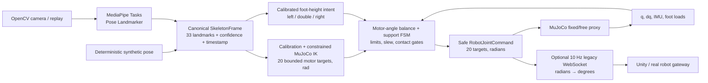

# Robot–human interface

Первый воспроизводимый прототип цепочки

`камера/MP4 → MediaPipe → SkeletonFrame → constrained MuJoCo IK → motor-angle safety → 20-DOF MuJoCo / legacy WebSocket`.

Проект работает нативно на Windows без виртуальной машины. Все зависимости,
модель MediaPipe и копии исходных FBX находятся внутри этого репозитория. Unity
использовался только как read-only источник параметров и визуальной геометрии.

> Это исследовательский прототип, а не готовый контур безопасности реального
> робота. В free-base MuJoCo уже работает классический motor-angle controller:
> он копирует руки, переносит вес перед подъёмом ноги, проверяет нагрузку стоп и
> не фиксирует корпус в физике. На реальном роботе ему всё ещё нужны настоящие
> encoder/IMU/foot-sensor observations, локальный watchdog и E-stop. Collision
> shapes, inertia/CoM и gains текущей модели явно помечены provisional. Основной
> запуск использует свободную базу без weld; grounded-fixed сцена доступна только
> как явный диагностический режим `-FixedBase`.

## Windows: пошаговый запуск

Все команды ниже нужно вводить в **PowerShell**, а не в Python-консоль. Подойдёт
Windows Terminal с профилем PowerShell или обычное приложение «Windows
PowerShell». Запуск от администратора не требуется. В примеры не нужно копировать
приглашение вида `PS C:\...>` — вводите только сами команды из блоков.

### 1. Один раз установите Python 3.12 x64

При установке Python желательно включить пункт `Add python.exe to PATH`. MuJoCo
отдельно устанавливать в Windows не нужно: он будет установлен в локальное
окружение проекта.

Откройте PowerShell и проверьте версию:

```powershell
python --version
```

Ожидаемый результат начинается с `Python 3.12`. Посмотреть, какой исполняемый
файл найден Windows, можно так:

```powershell
where.exe python
```

Если в системе несколько Python, запомните полный путь к версии 3.12 — его можно
передать скрипту на шаге 5.

### 2. В PowerShell перейдите в папку проекта

На текущем компьютере проект находится здесь:

```powershell
Set-Location "C:\Users\k_desktop\Desktop\robot-human-interface"
```

Если проект был перенесён, замените путь на фактический. Убедитесь, что вы
находитесь в правильной папке:

```powershell
Get-Location
Test-Path .\scripts\setup_windows.ps1
```

`Test-Path` должен вывести `True`. Все последующие команды выполняются **из этой
папки**.

### 3. Разрешите PowerShell-скрипты для текущего окна

```powershell
Set-ExecutionPolicy -Scope Process -ExecutionPolicy Bypass
```

Это разрешение действует только до закрытия текущего PowerShell и не изменяет
глобальные настройки Windows.

### 4. Проверьте, что камера доступна Windows

Этот шаг нужен только для управления по реальной камере. Подключите камеру и
выполните:

```powershell
Get-PnpDevice -Class Camera
```

Если список пуст, сначала подключите/включите камеру. Для запуска synthetic-
режима камера не требуется.

### 5. Подготовьте локальное окружение проекта

На первом запуске выполните:

```powershell
.\scripts\setup_windows.ps1
```

Скрипт создаст `.venv` внутри `robot-human-interface`, установит точные версии
из `requirements.lock.txt` и сам проект. Глобальный Python и другие проекты не
изменяются. Повторный вызов безопасен: существующая `.venv` будет использована
повторно.

Если скрипт не нашёл Python 3.12 автоматически, укажите полный путь, полученный
на шаге 1. Пример:

```powershell
.\scripts\setup_windows.ps1 -PythonExe "C:\Program Files\Python312\python.exe"
```

Успешная установка заканчивается сообщением `Windows setup complete`.

### 6. Первый безопасный запуск без камеры

Сначала проверьте весь pipeline на синтетическом скелете:

```powershell
.\scripts\run_camera_teleop.ps1 -Source synthetic
```

Откроются два окна:

1. `MuJoCo : humanoid_v4_free` — симуляция робота со свободным корпусом;
2. `Robot human interface - camera skeleton` — синтетический кадр и скелет.

Чтобы остановить программу, выберите окно `camera skeleton` и нажмите `Esc`.
В том же окне `camera skeleton` нажмите `V`, чтобы переключать MuJoCo между
полноценной 3D-моделью и кинематическим видом суставов.

Для управления ракурсом выберите именно окно MuJoCo: левая кнопка мыши
вращает свободную камеру, правая перемещает её, колесо приближает и отдаляет.
Приложение меняет только видимые слои и не сбрасывает выбранный мышью ракурс.

### 7. Запуск на встроенном MP4

В репозитории есть два лицензированных видео с человеком в полный рост. По
умолчанию запускается медленный 65-секундный тест: сначала плавные движения
руками, затем баланс последовательно на каждой ноге. Он проходит через тот же
MediaPipe → retargeting → MuJoCo pipeline, что и камера:

```powershell
.\scripts\run_camera_teleop.ps1 -Source mp4 -LoopReplay
```

То же самое с явным выбором теста:

```powershell
.\scripts\run_camera_teleop.ps1 -Source mp4 -DemoVideo slow-balance -LoopReplay
```

По умолчанию используется ограниченная joint limits обратная кинематика по
фактической модели MuJoCo. Она ищет ближайшую достижимую позу по направлениям
рук, ног, стоп и головы. Старый скалярный geometric mapper сохранён только как
воспроизводимый baseline для сравнения:

```powershell
.\scripts\run_camera_teleop.ps1 -Source mp4 -DemoVideo slow-balance -Retargeting geometric
```

Свободная физика и motor-angle balance layer без weld/каретки включены по
умолчанию. Старое явное написание `-FreeBase` сохранено для совместимости:

```powershell
.\scripts\run_camera_teleop.ps1 -Source mp4 -DemoVideo slow-balance -FreeBase
```

Grounded-fixed режим предназначен для отдельной проверки IK и визуальной модели
без оценки устойчивости и включается только явно:

```powershell
.\scripts\run_camera_teleop.ps1 -Source mp4 -DemoVideo slow-balance -FixedBase
```

На текущем полном прогоне slow-balance обе swing-стопы отрываются на
`3.43/3.16 cm` (правая/левая), максимальный наклон корпуса равен `14.576°`,
падение не регистрируется, а время MuJoCo расходится с временем MP4 меньше чем
на один шаг `2 ms`. При этом строгий stability acceptance этого клипа
**не пройден**: накопленное скольжение левой стопы `0.0781 m` выше лимита
`0.075 m`, а контактный импульс `9.303 N*s` выше лимита `9 N*s`.

Для строгой проверки конечной устойчивости можно потребовать, чтобы после
последнего кадра робот на **той же** свободной симуляции плавно вернулся в
double support и простоял ещё 5 секунд:

```powershell
.\scripts\run_camera_teleop.ps1 `
  -Source mp4 `
  -DemoVideo slow-balance `
  -SettleSeconds 5 `
  -SettleTimeoutSeconds 20 `
  -Headless
```

Успех отражается в итоговой строке как `settled=1`; касание пола не стопой,
падение во время возврата или нехватка времени делают acceptance неуспешным.

Старый быстрый ролик с jumping jacks сохранён как отдельный вариант:

```powershell
.\scripts\run_camera_teleop.ps1 -Source mp4 -DemoVideo jumping-jacks -LoopReplay
```

Медленный ролик воспроизводится с частотой 29,97 FPS, но движения внутри него
замедлены ровно в два раза. Откроются окно исходного кадра со скелетом и MuJoCo
viewer с роботом. Источник, авторы, лицензии, преобразования и контрольные суммы
записаны в `assets/README.md`.

### 8. Запуск с реальной камерой

Из того же PowerShell и той же папки выполните:

```powershell
.\scripts\run_camera_teleop.ps1 -Source camera
```

Короткая эквивалентная команда, поскольку `camera` является режимом по
умолчанию:

```powershell
.\scripts\run_camera_teleop.ps1
```

Автокалибровка не усредняет безусловно первые 30 детекций. Она ищет скользящее
окно из 30 полных уверенных кадров среди максимум 150 пригодных наблюдений.
Окно принимается только при неподвижной позе, двух лодыжках примерно на одном
уровне, опущенных руках без сильного сгиба локтей и выпрямленных ногах.
Неполные или перекрытые кадры не расходуют лимит. До успешной калибровки робот
удерживает neutral/home target. Пока приложение работает, нажмите `C`, чтобы
начать калибровку заново. Если лимит исчерпан и процесс завершился с
`NeutralCalibrationError`, запустите команду повторно и сразу удерживайте
нейтральную позу.

Для MP4, который начинается не с нейтральной стойки, можно вручную указать
отдельный проверенный кадр. Номер кадра отсчитывается с нуля; параметры
`-CalibrationVideo` и `-CalibrationFrame` обязательны вместе, разрешены только
для `mp4`/`replay` и никогда не выбираются автоматически:

```powershell
.\scripts\run_camera_teleop.ps1 `
  -Source replay `
  -VideoPath ".\assets\videos\external\dvids_frontal_leg_swing.mp4" `
  -CalibrationVideo ".\assets\videos\external\dvids_arm_circles.mp4" `
  -CalibrationFrame 29
```

Calibration video проходит через MediaPipe до выбранного кадра. Приложение
проверяет видимость, обе опорные стопы, положение рук/локтей и выпрямленность
ног, записывает абсолютный путь, SHA-256 и номер кадра, затем сбрасывает
MediaPipe tracking/filter перед основным роликом. Один кадр не доказывает
временную неподвижность: ответственность за выбор действительно спокойного
момента остаётся на операторе.

Если нужна другая камера или backend Windows:

```powershell
.\scripts\run_camera_teleop.ps1 -Source camera -CameraIndex 1
.\scripts\run_camera_teleop.ps1 -Source camera -CameraBackend dshow
.\scripts\run_camera_teleop.ps1 -Source camera -CameraBackend msmf
```

### 9. Опциональный вывод в Unity/на робота по WebSocket

Сетевой выход и подключение по умолчанию полностью выключены; библиотека
транспорта устанавливается обычным `setup_windows.ps1`. После проверки E-stop,
знаков/нулей моторов, локального watchdog и ограничения
скорости включите экспериментальный выход явным URL. Основной запуск уже
free-base; сочетание WebSocket с `-FixedBase` отклоняется до старта, чтобы наружу
не могла уйти необработанная fixed-base команда:

```powershell
.\scripts\run_camera_teleop.ps1 `
  -Source camera `
  -RobotWebSocketUrl "ws://127.0.0.1:1233"
```

Наружу отправляется именно итоговая `safe_command`, уже после balance/support
controllers, с частотой 10 Hz и latest-only семантикой. Формат байт-в-байт
совпадает с активным Unity-кодом; радианы переводятся в градусы только здесь:

```json
{"id":0,"method":"setPositions","params":[0.0,0.0,0.0,0.0,0.0,0.0,0.0,0.0,0.0,0.0,0.0,0.0,0.0,0.0,0.0,0.0,0.0,0.0,0.0,0.0]}
```

Обрыв сети не останавливает камеру и MuJoCo. Это пока shadow/experimental
boundary: controller получает q/dq/IMU/foot loads из MuJoCo, а не с настоящего
робота. До подачи мощности нужны реальная обратная связь, проверка ответа
сервера/`setVelocities` handshake, robot-side slew limit, watchdog на потерю
команд и безопасное повторное подключение от измеренных углов.

При EOF, `Esc` или ошибке источника текущий shadow-клиент закрывает транспорт,
но не может подтвердить по датчикам физического робота возврат в double support;
сервер может удержать последнюю команду. Поэтому до реализации real-feedback
shutdown этот путь нельзя использовать с включённой мощностью без независимого
watchdog, который сам переводит робота в заранее проверенное безопасное состояние.

Все приведённые stability/fidelity/robustness результаты относятся только к
provisional MuJoCo proxy. WebSocket не получает реальные encoder/IMU/foot-load
измерения, подтверждение исполнения, feedback-based reconnect или гарантированный
physical shutdown. Этот канал нельзя использовать с включённой мощностью без
отдельного robot-side controller, watchdog и аппаратного E-stop.

При активном `-RobotWebSocketUrl` клавиша `Space` намеренно отключена: заморозка
приложения оставила бы физический робот на последней, возможно одноопорной,
команде. Это не замена аварийной остановке — для реального стенда обязательны
аппаратный E-stop и независимый robot-side watchdog.

### 10. Клавиши управления во время работы

Клавиши обрабатываются, когда активно окно `Robot human interface - camera
skeleton`:

- `C` — заново откалибровать нейтральную позу и вертикаль камеры; встаньте
  ровно, поставьте обе стопы на пол и не двигайтесь;
- `R` — сбросить MuJoCo, retargeter, balance/support controllers и калибровку;
- `V` — переключить MuJoCo между 3D-моделью и видом суставов;
- `Space` — заморозить/продолжить видео и симуляцию; при активном выводе на
  физический робот эта клавиша заблокирована;
- `Esc` — закрыть приложение.

### 11. Полная автоматическая проверка

```powershell
.\scripts\run_checks.ps1
```

Команда проверяет импорты, запускает весь `pytest` и выполняет конечный
camera-free end-to-end smoke test.

### 12. Повторный запуск после перезагрузки Windows

Повторно устанавливать зависимости не нужно. Откройте PowerShell и выполните:

```powershell
Set-Location "C:\Users\k_desktop\Desktop\robot-human-interface"
Set-ExecutionPolicy -Scope Process -ExecutionPolicy Bypass
.\scripts\run_camera_teleop.ps1 -Source synthetic
```

Для реальной камеры замените последнюю строку на:

```powershell
.\scripts\run_camera_teleop.ps1 -Source camera
```

Для встроенного MP4 замените её на:

```powershell
.\scripts\run_camera_teleop.ps1 -Source mp4 -LoopReplay
```

Обработка идёт по незеркальному кадру, чтобы физическая правая сторона человека
однозначно управляла суставами `*_rh`. Значения камеры и confidence по умолчанию
читаются из `config/camera.yaml`; параметры командной строки имеют приоритет.
Если источник требует отражения, добавьте `-MirrorInput` — после inference
анатомические стороны будут канонизированы обратно.

## Запуск без камеры

Полностью сквозной deterministic smoke test использует синтетические кадры и
33-точечный синтетический скелет с движущейся правой рукой:

```powershell
.\scripts\run_camera_teleop.ps1 -Source synthetic -Headless -MaxFrames 120
```

Встроенное MP4 с реальным человеком:

```powershell
.\scripts\run_camera_teleop.ps1 -Source mp4 -LoopReplay
```

С произвольным MP4 пользователя:

```powershell
.\scripts\run_camera_teleop.ps1 -Source replay -VideoPath "C:\data\motion.mp4"
```

В проект также входят четыре независимых public-domain ролика DVIDS для
проверки кругов руками, маха ногой, приседания и наклонов корпуса. Например:

```powershell
.\scripts\run_camera_teleop.ps1 `
  -Source replay `
  -VideoPath ".\assets\videos\external\dvids_frontal_leg_swing.mp4" `
  -LoopReplay
```

Для демонстрации нового двустороннего приседа используйте:

```powershell
.\scripts\run_camera_teleop.ps1 `
  -Source replay `
  -VideoPath ".\assets\videos\external\dvids_stationary_squat.mp4" `
  -LoopReplay
```

После нейтральной калибровки камера распознаёт только согласованное
двустороннее сгибание ног с опусканием таза. Во время приседа контроллер
плавно выводит обе прямые руки горизонтально вперёд, удерживает обе стопы
нагруженными, блокирует одноопорный цикл и ограничивает глубину, скорость,
ускорение, наклон и capture point. Проверенный предел координаты колена равен
30°, но защитный governor может остановить движение раньше. Потеря необходимых
наблюдений запрещает дальнейшее углубление и запускает ограниченный возврат,
если двусторонняя опора подтверждена.

Источники, лицензии и SHA-256 всех роликов записаны в `assets/README.md`.

Чтобы зациклить пользовательский файл:

```powershell
.\scripts\run_camera_teleop.ps1 -Source replay -VideoPath "C:\data\motion.mp4" -LoopReplay
```

Начальный вид робота можно выбрать из PowerShell; во время работы клавиша `V`
переключает его без перезапуска и без изменения физики:

```powershell
# Полная оболочка из OBJ, режим по умолчанию
.\scripts\run_camera_teleop.ps1 -Source mp4 -LoopReplay -ViewerMode visual

# Только суставы и связи между ними
.\scripts\run_camera_teleop.ps1 -Source mp4 -LoopReplay -ViewerMode joints
```

Свободная база и motor-angle balance layer используются по умолчанию. Для
кинематической/визуальной диагностики с закреплённым корпусом укажите:

```powershell
.\scripts\run_camera_teleop.ps1 -Source mp4 -DemoVideo slow-balance -FixedBase
```

В используемом по умолчанию free-base режиме на каждом физическом шаге `2 ms`
выполняется motor-angle balance layer. Камера задаёт медленную целевую позу, а
q/dq, ориентация/угловая скорость
корпуса и нагрузки стоп определяют безопасную итоговую команду. Перед подъёмом
ноги робот сначала переносит вес на противоположную стопу и подтверждает её
нагрузку. Новый одноопорный цикл не начинается при наклоне больше `12°` или
угловой скорости больше `1 rad/s`; во время цикла выход за `18°`/`3 rad/s`
запускает контролируемое опускание и центрирование. При dropout действует тот
же безопасный возврат.

По умолчанию число физических шагов вычисляется по timestamps источника через
fixed-timestep accumulator. Поэтому MP4/camera FPS и MuJoCo time не расходятся;
ручной `--physics-steps-per-frame` нужен только для специальных экспериментов.
Headless MP4 может вычисляться быстрее реального времени, но при включённом
WebSocket автоматически воспроизводится в реальном времени. На железе
perception и локальный servo/balance loop всё равно должны быть разделены.

Запуск только стандартного MuJoCo viewer:

```powershell
.\.venv\Scripts\python.exe -m mujoco.viewer --mjcf=models\humanoid\scene_fixed.xml
```

Полный автоматический набор проверок:

```powershell
.\scripts\run_checks.ps1
```

Воспроизводимый тяжёлый free-base acceptance по двум встроенным и четырём
независимым роликам (MediaPipe → IK → balance/support → MuJoCo → 5 секунд
settling) запускается отдельно и сохраняет машинно-читаемый отчёт:

```powershell
.\.venv\Scripts\python.exe tools\evaluate_freebase_stability.py
```

Эквивалентный единый запуск обычных тестов и тяжёлой матрицы:

```powershell
.\scripts\run_checks.ps1 -FullFreeBaseAcceptance
```

Результат: `artifacts/freebase-stability.json`. Проверка прямо подтверждает
`neq=0`, free-joint `base_free` и один экземпляр `HumanoidSimulation/MjData` на
replay и settling. Для всех клипов действуют общие safety thresholds и заранее
объявленные clip-specific ожидания движения: `min z >= 0.80 m`, final
`z >= 0.88 m`, tilt `<=20°`, отсутствие падений, не-стопных контактов и любых
support aborts, skeleton coverage `>=85%`, stale fraction `<=10%`, media sync
error `<=3 ms`, loaded-foot slip `<=0.15 m/s` и `<=0.075 m` на стопу.

Landing episode начинается только после реально наблюдавшегося airborne sample.
Измеряются вертикальная скорость непосредственно перед контактом, пиковая сила
и полный импульс до перевода стопы в stance, включая solver chatter. Пороги:
`<=0.50 m/s`, `<=60 N`, `<=2.25 bodyweights`, `<=9 N*s` и
`<=0.30 weight*s`. Ранний удар в `LIFT/HOLD` не теряется.

`settled=1` означает непрерывный quiet interval на той же симуляции: double
support, обе стопы `>=4 N`, суммарно `>=20 N`, tilt `<=12°`, angular speed
`<=1 rad/s`, base speed `<=0.06 m/s`, max joint speed `<=0.40 rad/s`, tracking
error `<=0.12 rad`, loaded-foot slip `<=0.03 m/s` и neutral-relative capture
point error `<=0.07 m`. Любой support abort остаётся в статистике и даёт exit
code `3`, даже если модель затем восстановилась.

Touchdown timeout или длительная потеря контакта во время центрирования
защёлкивает fault: контроллер сохраняет известный опорный перенос веса,
продолжает опускать остаточный swing profile и блокирует новый подъём. Для
повторного цикла нужны подтверждённый физический контакт и новое наблюдение
double support.

Итоговая safe-команда и фактическая поза свободной модели проверяются отдельно:

```powershell
.\.venv\Scripts\python.exe tools\evaluate_safe_pose_fidelity.py
```

Отчёт `artifacts/safe-pose-fidelity.json` сравнивает human pose с финальным
`safe_command` после balance/support projection и с измеренным MuJoCo qpos.
Settling-кадры исключены. Для односторонних подъёмов ног ненадёжная монокулярная
3D-глубина остаётся описательной; acceptance использует FIFO camera intent ->
правильную сторону FSM -> `LIFT/HOLD` -> отсутствие abort -> safe/actual
clearance не менее `0.020 m`.

Номинальные движения, возмущения обоих направлений и domain randomization
запускаются без камеры:

```powershell
.\.venv\Scripts\python.exe tools\evaluate_freebase_robustness.py
```

Полный отчёт `artifacts/freebase-robustness.json` включает обязательные neutral,
upper-body, crouch обоих знаков, sagittal/lateral push обоих направлений и
single-support обеих ног. Каноническая матрица состоит из 10 critical nominal,
20 broad randomized и отдельного holdout из 40 single-support trials — по 20
на каждую сторону. Broad и обе стороны holdout оцениваются независимо по
нижней границе Wilson 95%; неполная или переупорядоченная матрица не может
получить acceptance. В provisional модели варьируются mass/inertia каждого
тела, friction, actuator strength/kp/kv и joint damping. Push — явно
объявленное тестовое внешнее возмущение; сам controller по-прежнему управляет
только 20 motor targets.

Проверка именно camera → MediaPipe → retargeter → MuJoCo без окон:

```powershell
.\scripts\run_camera_teleop.ps1 -Source camera -Headless -MaxFrames 30
```

## Диагностика Windows

Если PowerShell сообщает, что выполнение сценариев отключено, разрешите его
только для текущего процесса:

```powershell
Set-ExecutionPolicy -Scope Process Bypass
```

Если камера не открывается:

1. проверьте, видит ли её Windows: `Get-PnpDevice -Class Camera`;
2. разрешите desktop apps доступ к камере в Windows Privacy settings;
3. закройте Zoom/Teams/браузер, если они удерживают устройство;
4. попробуйте другой индекс: `-CameraIndex 1`;
5. явно выберите backend:

```powershell
.\scripts\run_camera_teleop.ps1 -CameraBackend dshow
.\scripts\run_camera_teleop.ps1 -CameraBackend msmf
```

Если GLFW/OpenGL viewer не открывается, обновите драйвер GPU, не запускайте GUI
из закрытой RDP-сессии и сначала проверьте headless-режим. Headless physics не
требует окна:

```powershell
.\scripts\run_camera_teleop.ps1 -Source synthetic -Headless -MaxFrames 120
```

Ошибка об отсутствующем `pose_landmarker_full.task` означает, что runtime asset
не скопирован. Ожидаемый путь — `assets/models/pose_landmarker_full.task`; его
SHA-256 приведён в `assets/README.md`.

## Архитектура



Основные границы данных намеренно не зависят от симулятора:

- `CameraFrame` — BGR-кадр с monotonic timestamp;
- `SkeletonFrame` — 33 landmarks, visibility/presence и система координат;
- `RobotJointCommand` — имена и 20 целевых положений строго в радианах;
- `HumanoidState` — joint state, положение/ориентация базы, IMU-подобные
  скорости, CoM, позиции/нагрузки стоп, усилия и число контактов;
- `HumanSupportEstimate` — confidence-gated намерение поднять левую/правую стопу;
- `safe RobotJointCommand` — единственная команда, которую получают MuJoCo и
  опциональный внешний WebSocket.

## Порядок суставов

Этот порядок совпадает с активным `humanoid_control` и существующим Unity
WebSocket-протоколом:

```text
 0 shoulder_rh       10 knee_rl
 1 shoulder_lh       11 knee_ll
 2 elbow_rh          12 shin_rl
 3 elbow_lh          13 shin_ll
 4 wrist_rh          14 motors_feet_rl
 5 wrist_lh          15 motors_feet_ll
 6 rotat_axis_rl     16 foot_rl
 7 rotat_axis_ll     17 foot_ll
 8 motors_thigh_rl   18 neck
 9 motors_thigh_ll   19 head
```

Внутри Python и MuJoCo используются радианы. Реализованный
`LegacyWebSocketEncoder` проверяет полный именованный набор, переставляет его в
этот порядок, проверяет Unity limits и переводит значения в градусы только на
внешней границе. Текущий legacy server не принимает schema/model id, поэтому
версионированный envelope остаётся следующим изменением протокола.

## Модель MuJoCo

- `scene_fixed.xml` связывает torso с кареткой, которая свободно движется по
  вертикали: обе стопы физически принимают вес робота, а x/y и ориентация базы
  стабилизированы для безопасной проверки копирующего интерфейса;
- `scene_free.xml` оставляет настоящий free joint базы; текущий controller
  удерживает его только целевыми углами 20 приводов, не записывая base pose и
  не прикладывая внешних сил;
- 21 OBJ-меш из Unity используется только для визуализации; `V` переключает
  mesh-вид и суставную схему, не затрагивая состояние и контакты;
- земля относится к render group 0, OBJ — к group 1, физические collision
  primitives — к group 2;
- 20 position actuators следуют каноническому порядку независимо от внутреннего
  body traversal MuJoCo;
- масса torso и 20 rigid bodies перенесена из активной Unity-модели; суммарно
  `2.933134 kg`;
- joint hierarchy, axes, anchors, limits и start pose извлечены из активного
  prefab;
- OBJ-геометрия получена из исходных FBX через изолированный Unity batch-import;
  primitive collisions, inertia/CoM, actuator gains, friction, масштаб `0.35`
  и преобразование Unity LH → MuJoCo RH пока **provisional**.

Unity не сериализует CoM и inertia: PhysX вычисляет их из convex MeshCollider во
время запуска. Поэтому выдать эти величины за точные было бы неверно. До
sim-to-real нужны CAD/URDF, реальные массы, геометрия коллизий, motor/gear data и
system identification.

Полный протокол извлечения находится в
[`docs/unity_model_extraction.md`](docs/unity_model_extraction.md), происхождение
FBX и MediaPipe bundle — в [`assets/README.md`](assets/README.md).

## Retargeting, перед робота и устойчивость

Текущая реализация разделяет кинематическое копирование и физическую
устойчивость. Ограниченный IK является основным retargeter, а прежний
geometric mapper оставлен как baseline, на фоне которого затем можно честно
сравнивать нейросеть:

1. MediaPipe Tasks выдаёт 33 точки, confidence и hip-relative learned 3D.
2. Скелет канонизируется и сглаживается с учётом confidence.
3. Калибровка фиксирует нейтральные направления видимых сегментов и систему
   тела пользователя. Длины кинематических звеньев берутся из робота; отдельный
   масштаб в плоскости изображения используется только для уверенного
   распознавания относительного подъёма ног.
4. IK минимизирует ошибки до 12 позиционных site-targets вместе с остатками
   направлений конечностей и головы по фактической FK модели MuJoCo, учитывает
   все 20 joint limits и непрерывность решения между кадрами.
5. Для полных оборотных суставов выбирается ближайшая эквивалентная ветвь угла,
   поэтому переход через `±π` не создаёт скачок почти на `360°`.
6. При кратком dropout удерживается последняя команда; затем робот плавно
   возвращается в neutral pose.
7. Перед человека определяется в реальных MediaPipe camera axes; semantic FK
   tests проверяют, что рука/нога вперёд движутся вдоль физического переда
   робота `-X`, а не просто дают ожидаемый знак в массиве.
8. В grounded-fixed режиме вся достижимая IK-поза передаётся в приводы. В
   free-base режиме balance compositor сохраняет безопасную долю непрерывной
   позы ног, ограничивает верх тела в одноопорной фазе и добавляет motor-angle
   residual по IMU-подобным pitch/pitch-rate и capture point центра масс
   относительно реально нагруженных стоп. При выходе capture point из
   внутреннего запаса поза плавно ослабляется, а симметричная hip/knee/ankle
   стратегия возвращает давление внутрь опоры — без weld, внешней силы или
   записи floating-base pose.
9. Двусторонний присед распознаётся отдельным калиброванным 2D-признаком
   опускания таза и согласованного сгибания обоих бёдер и коленей. Stateful
   planner переводит глубину в sole-preserving manifold
   `[hip, knee, ankle] = [5q/3, q, -2q/3]`, ограничивает `q`, скорость и
   ускорение, а capture residual во время приседа подаёт только на голеностоп.
   Одновременно `smoothstep(q / 19°)` разворачивает фиксированную симметричную
   позу рук: плечи `84.6969°`, локти и кисти `0°`. Отдельная squat-only
   компенсация поднятых рук не меняет обычное копирование верхней части тела.
   Углубление разрешено лишь при валидных COM/скорости/суставах, подтверждённой
   нагрузке обеих стоп и безопасных наклоне и capture point; одноопорный цикл
   ждёт также фактического возврата рук после reset или завершения приседа.
10. Подъём стопы превращается в последовательность `shift → verify load → lift →
   hold → lower → verify touchdown → center`: отрыв разрешается только после
   подтверждённой нагрузки противоположной стопы, а перенос веса обратно —
   только после измеренного контакта возвращённой стопы с полом.
11. Если человек поднимает вторую ногу, пока робот безопасно завершает первый
    цикл, намерение хранится в одном ограниченном по времени слоте и запускается
    лишь после подтверждённого возврата в `double support`; прямого переключения
    опорной ноги в воздухе нет.
12. Перед началом одноопорного цикла и во время его активной части проверяются
    ориентация корпуса и полная угловая скорость; выход за настроенный envelope
    не меняет base pose, а переводит те же моторные targets в безопасный возврат.

Таким образом сеть позже сможет выдавать bounded residual к этому baseline, а
не учиться одновременно угадывать индексы моторов, кинематику и базовое
поведение при потере опоры.

Landmarks с низкой уверенностью не используются для соответствующего сустава.
Например, плохие `INDEX/PINKY` не могут создать случайную команду wrist, а
плохие `NOSE/EARS` — команду головы.
Задача, которой не было видно в нейтральном калибровочном окне, остаётся
недоступной до явной повторной калибровки: первая уже движущаяся поза не может
незаметно стать новым нулём только для кисти или головы.

MediaPipe monocular world landmarks нельзя считать точным измерением глубины или
анатомических центров суставов. Для научной ветки имеет смысл добавить RGB-D,
кинематический fit и сравнить MediaPipe с обучаемым RTMPose/RTMW3D baseline.

Механические ограничения остаются реальными ограничениями: у плеча этой модели
только одна вращательная степень свободы, поэтому боковой подъём руки невозможно
совместить точно во всех трёх координатах. IK минимизирует FK-ошибку всей цепи и
выбирает ближайшую достижимую позу, но не создаёт отсутствующий привод.

## Структура

```text
assets/                         MediaPipe bundle, тестовый MP4 и копии 21 Unity FBX
config/                         joint/camera/retargeting/balance параметры
docs/                           протокол извлечения и ограничения
models/humanoid/                MJCF, fixed/free scenes и 21 visual OBJ
scripts/                        setup, запуск и проверки Windows
src/robot_human_interface/
  app/                          end-to-end цикл и CLI
  camera/                       camera, replay, synthetic frame sources
  pose/                         MediaPipe Tasks и synthetic skeleton
  skeleton/                     типы, фильтрация, transforms
  retargeting/                  geometric baseline, constrained IK, FK fidelity
  control/                      standing balance, foot intent, support FSM
  protocol/                     legacy Unity/WebSocket encoder + 10 Hz publisher
  simulation/                   MuJoCo API и state/command boundary
tests/                          unit, model, physics и integration tests
tools/fbx_converter_unity/      изолированный FBX → OBJ batch-конвертер
```

## Переезд на Ubuntu 24.04

MuJoCo не требует Ubuntu 22.04. Ubuntu 24.04 содержит Python 3.12 и является
правильной целью для будущего ROS 2 Jazzy. Код использует `pathlib` и не требует
Windows API; платформенными остаются только PowerShell wrappers.

Базовая установка без ROS:

```bash
sudo apt update
sudo apt install python3-venv libgl1 libglib2.0-0 libportaudio2
python3 -m venv .venv
source .venv/bin/activate
python -m pip install -r requirements.lock.txt
python -m pip install --no-deps --no-build-isolation -e .
python -m pytest
python -m robot_human_interface.app.teleop --source synthetic --headless --max-frames 120
```

Для GUI нужен рабочий OpenGL/display. На headless-машине остаются unit tests и
physics loop; camera/display можно подключать отдельно.

Следующий инфраструктурный этап на Ubuntu:

1. оформить robot description как единый URDF/xacro + meshes + calibration;
2. добавить ROS 2 Jazzy nodes для `SkeletonFrame`, reference command и state;
3. подключить `ros2_control`/`mujoco_ros2_control` для одинаковой controller
   boundary в симуляции и на железе;
4. обернуть уже реализованный legacy WebSocket boundary версионированным
   ROS/robot-state adapter, оставив его внешним 10 Hz каналом, а не внутренним
   servo loop;
5. экспортировать будущую policy в ONNX и проверять одинаковый порядок
   observations/actions на Windows, Ubuntu, MuJoCo и роботе.

Официально MuJoCo ставится через `pip install mujoco`, причём библиотека входит
в wheel: [MuJoCo Python documentation](https://mujoco.readthedocs.io/en/latest/python.html).
Для Jazzy уже существует пакет
[`mujoco_ros2_control`](https://control.ros.org/jazzy/doc/mujoco_ros2_control/doc/index.html).

## Научное продолжение

Корректная будущая policy не должна получать только скелет человека. Одна и та
же целевая поза требует разных действий в зависимости от текущего состояния
робота. Практичная постановка:

```text
(human target / q_IK, robot q/dq, IMU, previous action, short history)
    → bounded residual Δq
q_des = clamp(q_IK + scale · tanh(Δq))
```

MediaPipe/camera остаются сравнительно медленным каналом намерения. Быстрый
balance loop, encoder/IMU feedback, limits, watchdog и E-stop должны работать
локально на роботе и не зависеть от WebSocket или камеры.

Полезные baseline для диссертации: direct copy, geometry+clamp, constrained IK,
absolute RL, residual-on-IK, privileged teacher→deployable student и independent
safety shield. Оценивать следует не только pose error, но и fall rate,
time-to-fall, foot slip, contact errors, latency p50/p95/p99, torque saturation,
jerk, recovery from pushes и sim-to-sim/sim-to-real gap.

Воспроизводимая оценка позы на встроенном и четырёх внешних роликах:

```powershell
.\.venv\Scripts\python.exe tools\evaluate_pose_fidelity.py --stride 5
```

Она сравнивает geometric baseline и raw IK по угловой ошибке направлений
конечностей в FK, а не только по значениям motor targets. Для grounded-fixed
запуска этот IK target является итоговой командой. В free-base режиме после него
намеренно работает balance/support projection, поэтому JSON не выдаётся за
оценку финальной одноопорной safe-команды. Результат сохраняется в
`artifacts/pose-fidelity.json`.

Production-path оценка находится в отдельном отчёте:

```powershell
.\.venv\Scripts\python.exe tools\evaluate_safe_pose_fidelity.py
```

Она записывает финальный `safe_command` и фактический free-base qpos на каждом
входном кадре, проверяет coverage, task-space mean/p50/p90, амплитуду,
корреляцию и лаг. Для unilateral leg clips вместо заведомо слабой глобальной
3D-корреляции используется событийное соответствие стороны жеста и физического
подъёма той же стопы.

Визуальный контроль четырёх характерных поз из медленного ролика строится
отдельной воспроизводимой командой:

```powershell
.\.venv\Scripts\python.exe tools\render_pose_comparison.py
```

Она сохраняет сопоставление `human + MediaPipe` / `robot true front` /
`robot rear` в `artifacts/ik-pose-comparison.png`. На изображении правая
сторона робота помечена оранжевым, левая — зелёным; вид сзади добавлен, чтобы
экранные стороны человека и робота можно было сравнить без фронтального
зеркального эффекта.

У монокулярного MediaPipe глубина ног иногда меняет знак на согнутых позах.
Поэтому сторона явно поднятой ноги уточняется согласованным 2D-признаком
«высота голеностопа + сгиб колена»; он включается только для уверенного
одностороннего подъёма. В остальных позах IK использует исходную 3D-геометрию.
Это ограничение и отдельные 2D/FK-регрессии важны для честной интерпретации
метрик из `pose-fidelity.json`.

## Проверка функции приседа

Текущая реализация проверена 16 августа 2026 года на полном ролике
`dvids_stationary_squat.mp4` в production-контуре
MediaPipe → intent → IK → balance → free-base MuJoCo:

- все четыре обязательных канала бедра/голени прошли неизменённые пороги
  амплитуды, корреляции и задержки (`4/4`);
- планировщик достиг `29.184°` против прежних `23.048°`; при `q ≥ 19°` обе
  кисти находились впереди `100%` времени с минимальным выносом `0.4124 m`,
  а фактические плечи достигали примерно `83.04°`;
- робот не упал и не коснулся пола ничем, кроме стоп: минимальная высота базы
  `0.8185 m`, максимальный наклон `11.53°`;
- обе стопы остались в допустимом контакте, а пятисекундное успокоение после
  ролика прошло (`z=0.9242 m`, наклон `1.29°`);
- пять остальных канонических роликов дали ровно `0` ложных активаций приседа;
- свежие 20 вариаций модели прошли безопасность и возврат `20/20`, но только
  `16/20` достигли `q ≥ 24°`: в четырёх случаях штатный capture guard
  консервативно остановил глубину на `23.09–23.82°`;
- полный pytest-набор текущего дерева: **993 passed** за `105.55 s`.

Эта проверка относится к текущему working tree. Канонические JSON-артефакты,
описанные ниже, были сформированы до добавления приседа и намеренно не
переписывались частичным запуском одного клипа.

## Проверенный статус опубликованных артефактов

Проверка выполнена 15 августа 2026 года на ревизии
`8349fcdcb2d51f43d963077ed624d01a9b894695`:

- полный pytest-набор: **793 passed** за `103.20 s`;
- `compileall` для `src`, `tests`, `tools` и `git diff --check`: успешно;
- raw pose report schema 3 полностью измерен (`measurement_complete=true`),
  но это только диагностика: пороги fidelity для него не заданы, поэтому он
  не является pose-fidelity acceptance;
- free-base stability: **FAIL, 4/6** клипов. Slow-balance не прошёл по
  скольжению и контактному импульсу; frontal-leg-swing завершился с
  `stale_support_intent`. Остальные четыре клипа прошли;
- production SAFE fidelity: **FAIL, 3/6** клипов. Slow-balance, arm-circles и
  trunk-circles прошли; jumping-jacks воспроизводит `2/4` требуемых каналов,
  stationary-squat — `0/4` в этом архивном отчёте; frontal-leg-swing выполнил
  один подъём, но начал лишний незавершённый цикл и получил abort;
- robustness schema 3: critical **10/10**, broad randomized **16/20**,
  независимый one-leg holdout только **14/40** — справа `9/20`, слева `5/20`.
  Нижние границы Wilson 95% равны `0.58398`, `0.25820` и `0.11186` при
  требуемой `0.80`; восемь holdout trials закончились реальным падением.

Попытки локально исправить оставшиеся дефекты не были перенесены в production:
high-authority движение ног для jumping-jacks проходило исходный клип, но
падало на непериодических входах; устойчивый вариант не достигал требуемой
амплитуды. Несколько force/CoP landing overlays также не обобщились на
независимые trials. Следующий технически обоснованный шаг для одноопорной
динамики — связанный constrained `(shift, lift)` planner или MPC с predictive
braking и terminal set, а не дальнейшая подстройка порогов. Эти ограничения
считаются открытыми дефектами, а не пройденными возможностями. Ранний
отклонённый планировщик приседа из этого исторического прогона не является
нынешним калиброванным double-support controller, проверенным выше.

Таким образом, отсутствие падения само по себе не означает, что движение
достаточно точно или что пройдены контактные пороги. Текущие JSON-отчёты:
`artifacts/pose-fidelity.json`, `artifacts/freebase-stability.json`,
`artifacts/safe-pose-fidelity.json` и `artifacts/freebase-robustness.json`.

Лог: `artifacts/verification.log`. Проверенные offscreen-кадры обоих режимов:
`artifacts/mujoco_fixed_home.png`, `artifacts/mujoco_joints_home.png` и
`artifacts/ik-pose-comparison.png`.

На машине, где собирался проект, Windows не обнаружила ни одного устройства
класса Camera, поэтому физический webcam frame проверить было невозможно.
MediaPipe Full bundle при этом был реально открыт через Tasks API и выполнил
inference; полный camera-free pipeline проверен synthetic-источником. После
подключения камеры используйте camera smoke command из раздела диагностики.
Legacy WebSocket остаётся только 10 Hz command-only каналом: в этой сборке нет
реальной обратной связи encoder/IMU/foot-load, подтверждения исполнения,
локального watchdog и аппаратного E-stop. Подавать через него мощность на
физический робот нельзя без отдельного robot-side safety controller.
